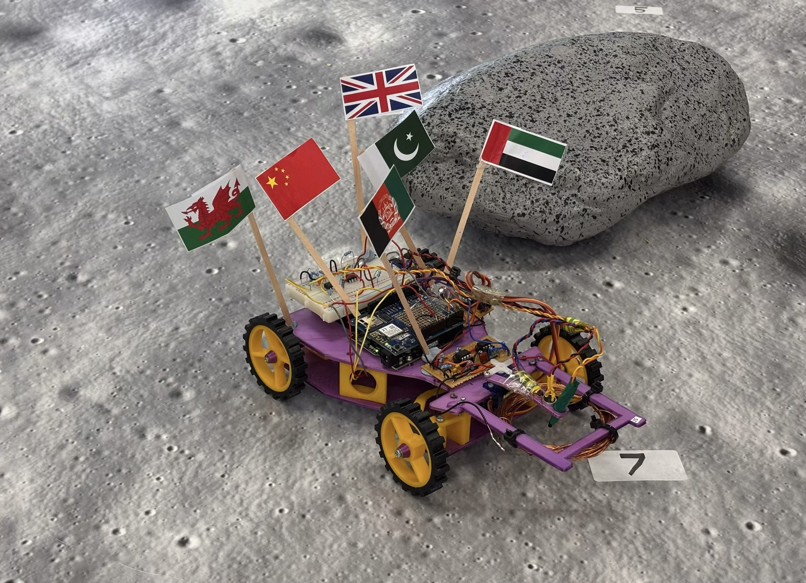
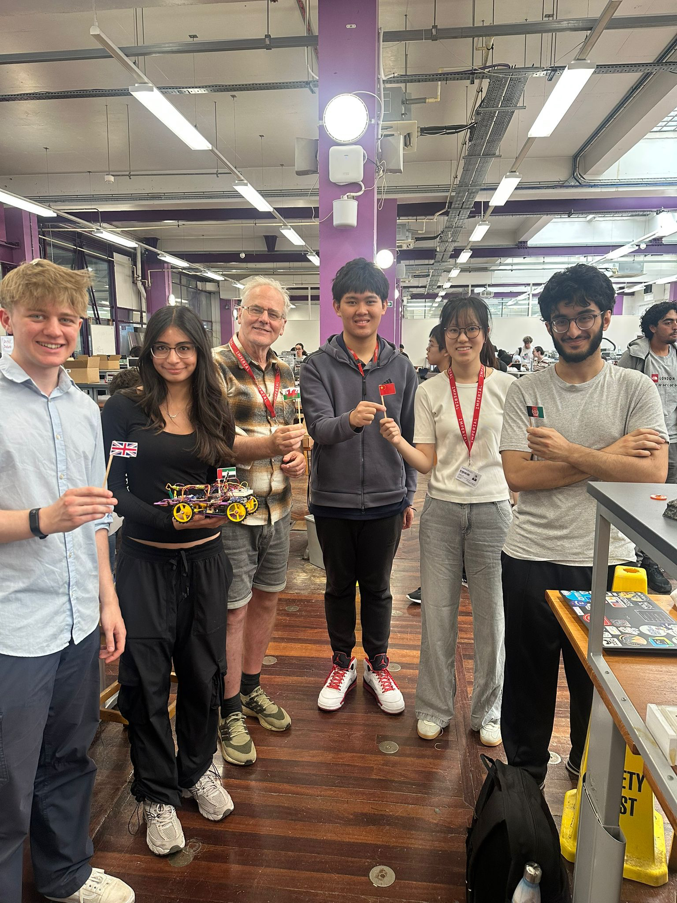
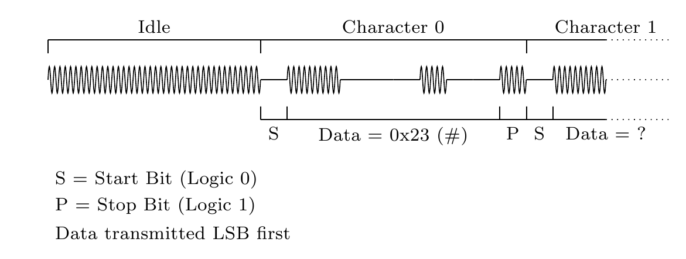

# EEE Lunar Rover Project 2026 - Group 25

**Good news! Our work was selected by the Department of EEE for the Best First
Year Project 2026 prize, recognising the dedication and hard work of the whole
team. Congratulations to everyone involved.**

This repository contains the organised software, firmware, CAD, presentation,
and final report materials for the Group 25 ELEC40006 summer rover project.

The rover is a WiFi-controlled lunar surface rover designed to navigate towards
artificial rocks, read their magnetic, infrared, ultrasound, and RF signals, and
classify the rock type from those sensor readings.


## Project photos





## Repository layout

| Path | Contents |
| --- | --- |
| [`firmware/arduino/final/`](firmware/arduino/final/) | Final combined rover control and detection Arduino sketch. |
| [`firmware/arduino/tests/`](firmware/arduino/tests/) | Earlier tested sketches for control, detection, and RF experiments. |
| [`software/web/`](software/web/) | Flask bridge server and browser interfaces for control and detection. |
| [`mechanical/cad/`](mechanical/cad/) | Full rover STL assembly and individual 3D-printable STL parts. |
| [`docs/report/`](docs/report/) | Final project report PDF. |
| [`docs/presentation/`](docs/presentation/) | Interim presentation PDF. |

## System summary

- Primary controller: Adafruit Metro M0 Express with WINC1500 WiFi shield.
- Rover structure: rear-wheel drive with front-wheel steering.
- Sensor head: combined magnetic, IR, ultrasound, and RF sensing mount.
- Front end: browser pages for mode selection, manual control, and detection.
- Server bridge: Flask app that proxies commands/data between a laptop and the rover.

## Rock classification

| Rock type | IR rate | Ultrasound | Magnetic polarity |
| --- | --- | --- | --- |
| Basaltoid | High, lambda >= 430 | Detected | Down |
| Gravion | Low, lambda < 430 | Absent | Down |
| Regolix | Low, lambda < 430 | Detected | Up |
| Lunarite | High, lambda >= 430 | Absent | Up |

The RF signal provides the rock age as a UART-encoded RF signal using an 89 kHz
carrier frequency.



The classification logic is implemented in both the Arduino firmware and the
Flask bridge so that the front end can continue to display a sensible result
when the Arduino omits `rock_type`.

## Quick start

1. Open [`firmware/arduino/final/control_monitor_combined/control_monitor_combined.ino`](firmware/arduino/final/control_monitor_combined/control_monitor_combined.ino).
2. Replace `YOUR_WIFI_SSID` and `YOUR_WIFI_PASSWORD` with the rover WiFi details.
3. Upload the sketch to the Adafruit Metro M0 Express from the Arduino IDE.
4. Run the web bridge:

```bash
cd software/web
python3 -m venv .venv
source .venv/bin/activate
pip install -r requirements.txt
ARDUINO_URL=http://<rover-ip> python rover_server.py
```

5. Open `http://localhost:5050` in a browser.

EL.PSY.KONGROO
