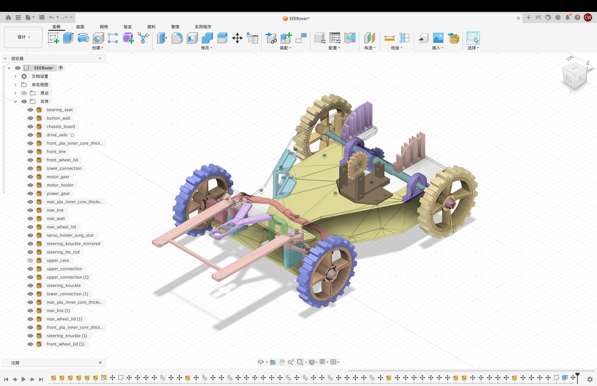

# Mechanical and CAD

3D-printable rover geometry exported as STL.

## Structure development

Figure 1 shows the earliest structure used at the start of the project. It was
built entirely from lab kit materials and designs, with no additional parts
required. This version used two motors with differential steering.

*Figure 1. Initial lab-kit differential-steering structure.*

Figure 2 shows the final rover structure designed by the group. It uses a
unique steering system and is implemented entirely with 3D-printed parts. The
design inspiration and prototype reference came from the open-source PYPER2
project by Tim Hanewich: [TimHanewich/PYPER2](https://github.com/TimHanewich/PYPER2).

*Figure 2. Final 3D-printed rover structure with custom steering.*

## Layout

- `cad/fully_assembled_rover.stl` - full rover assembly.
- `cad/parts/` - individual printable parts for the chassis, transmission,
  steering, sensor mount, board mounts, wheels, and enclosure.

## Design summary

The final rover uses rear-wheel drive and front-wheel steering. A single rear
drive motor powers the back axle through gears, while an SG90 servo controls
the front steering linkage. A second servo moves the sensor mount so the
magnetic, IR, ultrasound, and RF sensors can be aligned with the target rock.

The report records a final rover mass of 512 g, below the 750 g limit.
