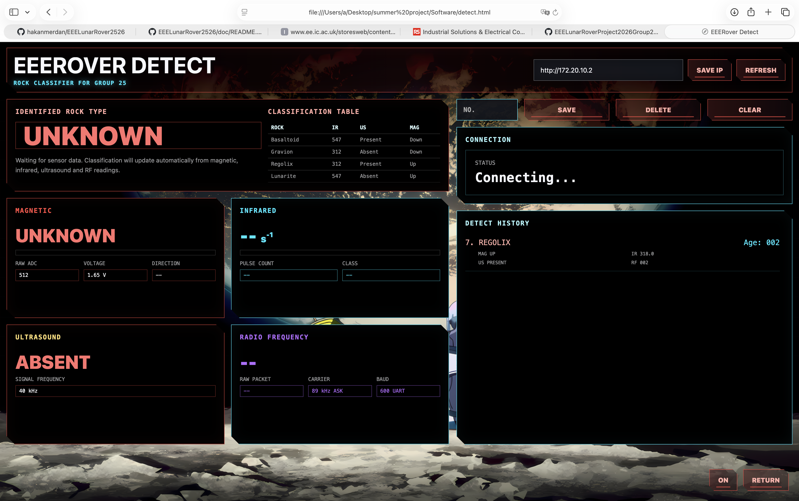

# Web Interface

This folder contains the Flask bridge server and static browser pages.

## Files

- `rover_server.py` - Flask app that polls the Arduino `/data` endpoint and forwards drive commands.
- `index.html` - landing page for choosing control or detection mode.

  

- `control.html` - keyboard/manual rover control page.

  

- `detect.html` - live rock classification and sensor telemetry page.

  

- `assets/` - background images and screenshots used by the web interface.

## Run locally

```bash
python3 -m venv .venv
source .venv/bin/activate
pip install -r requirements.txt
ARDUINO_URL=http://<rover-ip> python rover_server.py
```

Environment variables:

- `ARDUINO_URL` - rover HTTP server address. Default: `http://172.20.10.2`.
- `HOST` - Flask host. Default: `0.0.0.0`.
- `PORT` - Flask port. Default: `5050`.

Open `http://localhost:5050` after the server starts.
